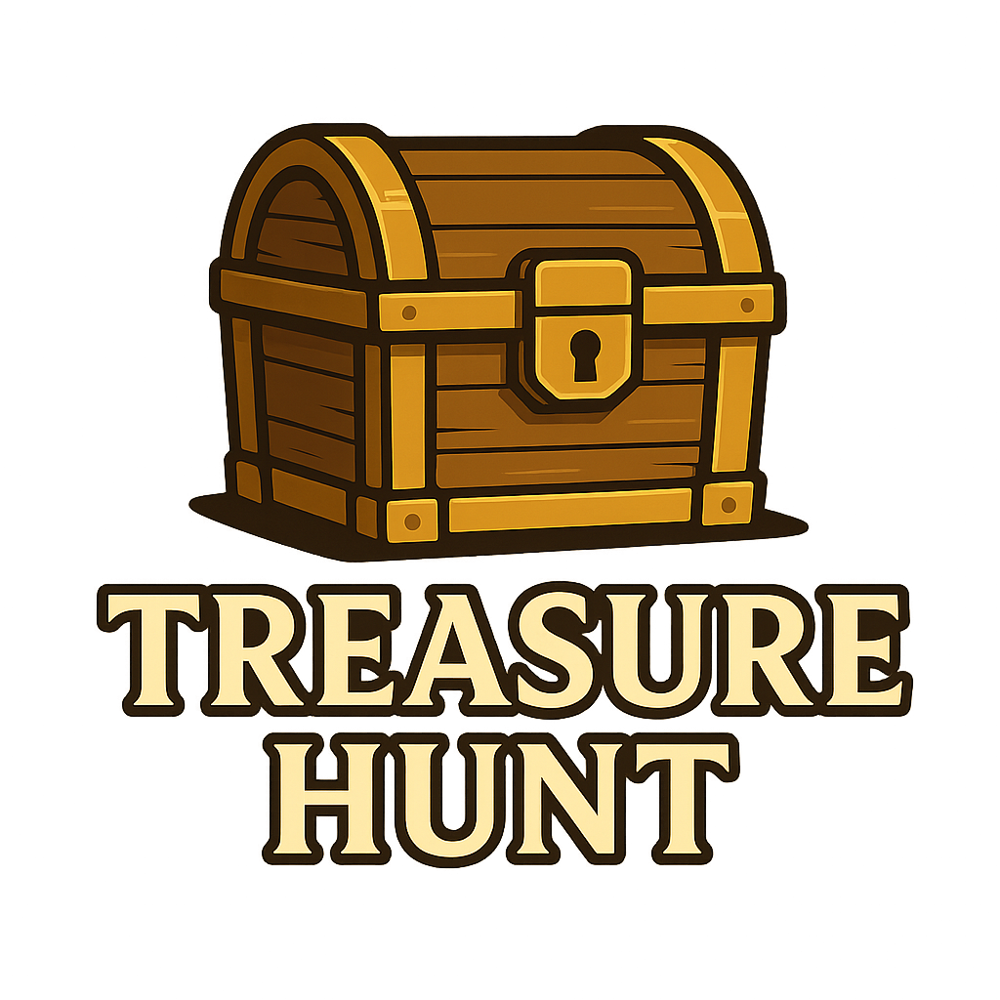

# ⚓ Pirates of the Caribbean: Blackbeard's Treasure Hunt

<div align="center">
  

  <h3 align="center">🏴‍☠️ Interactive Mechatronic Treasure Hunt Adventure</h3>

  <p align="center">
    <em>"Not all treasure is silver and gold, mate"</em>
    <br />
    Embark on a thrilling to claim Blackbeard's Eternal Life Potion
    <br />
    <a href="https://github.com/williamhwulff/MTRX2700FINAL">View Demo</a>
  </p>
</div>

<!-- TABLE OF CONTENTS -->
<details>
  <summary>Table of Contents</summary>
  <ol>
    <li>
      <a href="#about-the-project">About The Project</a>
      <ul>
        <li><a href="#built-with">Built With</a></li>
      </ul>
    </li>
    <li>
      <a href="#the-treasure-hunt-adventure">The Treasure Hunt Adventure</a>
      <ul>
        <li><a href="#stage-1-pirates-jingle">Stage 1: Pirates Jingle</a></li>
        <li><a href="#stage-2-jack-sparrows-riddle">Stage 2: Jack Sparrow's Riddle</a></li>
        <li><a href="#stage-3-dead-mans-mine-field">Stage 3: Dead Man's Mine Field</a></li>
        <li><a href="#final-stage-blackbeards-treasure">Final Stage: Blackbeard's Treasure</a></li>
      </ul>
    </li>
    <li>
      <a href="#getting-started">Getting Started</a>
      <ul>
        <li><a href="#prerequisites">Prerequisites</a></li>
        <li><a href="#installation">Installation</a></li>
      </ul>
    </li>
    <li><a href="#system-architecture">System Architecture</a></li>
    <li><a href="#hardware-components">Hardware Components</a></li>
    <li><a href="#software-modules">Software Modules</a></li>
    <li><a href="#contributing">Contributing</a></li>
    <li><a href="#contact">Contact</a></li>
    <li><a href="#acknowledgments">Acknowledgments</a></li>
  </ol>
</details>

<!-- ABOUT THE PROJECT -->
## About The Project

[![Pirates Treasure Hunt][product-screenshot]](https://example.com)

**Ahoy, matey!** Welcome to the ultimate Pirates of the Caribbean treasure hunt experience! This interactive mechatronic adventure combines the thrill of pirate lore with cutting-edge embedded systems technology. Players must navigate through four challenging stages, each testing different skills - from musical timing to cryptographic decoding and precision control.

### 🏴‍☠️ The Legend
Deep in the Caribbean, the infamous Blackbeard hid his most precious treasure - the **Eternal Life Potion**. Legend says only those who can prove their worth through trials of rhythm, wit, and skill can claim this legendary elixir. Do you have what it takes to outsmart Blackbeard's ingenious traps?

### ⚡ Key Features:
* **🎵 Musical Challenge**: Rhythm-based interaction with Pirates theme song
* **🔐 Cryptographic Puzzles**: Morse code riddles testing logical thinking  
* **🎮 Motion Control**: Gyroscope-controlled marble navigation
* **🤝 Multi-Board Communication**: Coordinated STM32 board interactions
* **⚙️ Servo-Controlled Mechanisms**: Physical trap doors and treasure chest
* **💎 Progressive Difficulty**: Each stage builds upon the last

### 🎯 Technical Achievements:
- **Multi-STM32 Architecture**: 4 interconnected microcontroller boards
- **Real-time Audio Processing**: Musical timing detection and feedback
- **Inter-board Communication**: GPIO-based signaling between controllers
- **Motion-Controlled Interface**: Pan-tilt unit with gyroscope integration
- **Physical Automation**: Servo-controlled mechanical elements
- **Pressure Sensing**: Marble detection and final treasure unlock

<p align="right">(<a href="#readme-top">back to top</a>)</p>

### Built With

This adventure is powered by:

* [![STM32][STM32.com]][STM32-url]
* [![C][C.com]][C-url]
* 
* 
* 
* 
* 

<p align="right">(<a href="#readme-top">back to top</a>)</p>

<!-- THE TREASURE HUNT ADVENTURE -->
## 🏴‍☠️ The Treasure Hunt Adventure

### Stage 1: Pirates Jingle 🎵
> *"The seas be callin', but first ye must prove yer rhythm!"*

**The Challenge**: As the iconic Pirates of the Caribbean theme song plays through a speaker, adventurers must tap a button in perfect synchronization with the melody. Miss the rhythm, and ye be walkin' the plank!

**Technical Implementation**:
- **STM32 Board #1**: Audio processing and button timing analysis
- **Algorithm**: Real-time comparison of button presses against pre-programmed melody timing
- **Success Trigger**: GPIO signal sent to Board #2 upon successful completion
- **Physical Response**: Servo-controlled trap door releases marble to next stage

**Skills Tested**: Musical timing, rhythm recognition, hand-eye coordination

---

### Stage 2: Jack Sparrow's Riddle 🔐
> *"Captain Sparrow's secrets be hidden in dots and dashes, savvy?"*

**The Challenge**: Decipher encrypted Morse code messages transmitted through the system. Each dot and dash translates to binary (0s and 1s), which adventurers must decode and input via serial communication.

**Technical Implementation**:
- **STM32 Board #2**: Morse code generation and serial communication handling
- **Encryption System**: Multi-layered Morse code messages of increasing difficulty
- **User Interface**: Serial port input for decoded message submission
- **Validation**: Real-time comparison against stored correct answers
- **Progress System**: Multiple messages must be solved to advance

**Skills Tested**: Cryptographic thinking, pattern recognition, communication protocols

---

### Stage 3: Dead Man's Mine Field ⚡
> *"Navigate these cursed waters, or be blown to Davy Jones' locker!"*

**The Challenge**: Control a marble through a treacherous minefield using the STM32 board as a motion controller. Tilt and rotate the board to guide the marble into the correct hole while avoiding the mines!

**Technical Implementation**:
- **STM32 Board #3**: Gyroscope-based motion sensing (independent system)
- **Pan-Tilt Unit**: Dual-servo platform responds to controller movements
- **Visual Feedback**: 4 holes with LED indicators (3 red danger zones, 1 green safe zone)
- **Physics Simulation**: Real marble navigation on tilting platform
- **Win Condition**: Successfully navigate marble into green-lit hole

**Skills Tested**: Hand-eye coordination, spatial reasoning, precise motor control

---

### Final Stage: Blackbeard's Treasure 💰
> *"The treasure be within reach, but Blackbeard's final trap awaits!"*

**The Reward**: Upon successfully landing the marble in the correct hole, a limit switch detects the marble's presence and triggers the final servo mechanism. The legendary treasure chest opens to reveal **Blackbeard's Eternal Life Potion**!

**Technical Implementation**:
- **Limit Switch**: Detects marble arrival in winning hole
- **Final Servo**: Chest-opening mechanism activation
- **Treasure Reveal**: Physical treasure chest with the coveted potion
- **Victory Celebration**: LED and audio feedback for successful completion

<p align="right">(<a href="#readme-top">back to top</a>)</p>

<!-- GETTING STARTED -->
## Getting Started

To set up this legendary treasure hunt experience:

### Prerequisites

**Hardware Requirements:**
- **4x STM32F3 Discovery Boards** (primary controllers)
- **1x Pan-Tilt Unit (PTU)** with dual servo motors
- **1x Gyroscope Module** (IMU with 3-axis sensing)
- **4x Servo Motors** (trap door and chest mechanisms)
- **4x PLimit Switches** (marble detection)
- **4x RGB LEDs** (Gold, Red, and green colours used)
- **1x Speaker** (Pirates theme song playback)
- **1x Push Button** (rhythm challenge input)
- **Connecting Wires** (GPIO inter-board communication)
- **5V Power Supply** (sufficient amperage for all servos)
- **Physical Construction Materials** (marble track, chest, etc.)

**Software Requirements:**
- STM32CubeIDE or compatible ARM development environment
- Serial communication terminal (for Morse code challenge)
- Audio files (Pirates of the Caribbean theme song)
- Git for version control

### Installation

1. **Clone the treasure map** (repository)
   ```sh
   git clone https://github.com/williamhwulff/MTRX2700FINAL.git
   cd MTRX2700FINAL
   ```

2. **Prepare your crew** (hardware setup)
   ```
   • Connect 4 STM32 boards according to wiring diagram
   • Wire GPIO pins for inter-board communication (Boards 1→2→3)
   • Set up Pan-Tilt Unit with gyroscope (Board 4 - independent)
   • Install servo mechanisms for trap doors and treasure chest
   • Position LEDs and limit switches in minefield area
   ```

3. **Load the ship's manifest** (flash firmware)
   ```
   • Board 1: /src/stage1_pirates_jingle/
   • Board 2: /src/stage2_morse_code/
   • Board 3: /src/stage3_minefield_control/
   • Board 4: /src/pan_tilt_gyro_control/
   ```

4. **Test the waters** (system verification)
   ```sh
   # Verify inter-board communication
   # Test servo responses
   # Validate audio playback
   # Check sensor readings
   ```

<p align="right">(<a href="#readme-top">back to top</a>)</p>

<!-- SYSTEM ARCHITECTURE -->
## System Architecture

```
🏴‍☠️ PIRATES TREASURE HUNT SYSTEM ARCHITECTURE 🏴‍☠️

┌─────────────────────────────────────────────────────────────────┐
│                    TREASURE HUNT FLOW                          │
└─────────────────────────────────────────────────────────────────┘

┌──────────────┐    GPIO    ┌──────────────┐    GPIO    ┌──────────────┐
│   BOARD #1   │ ────────→  │   BOARD #2   │ ────────→  │   BOARD #3   │
│              │   Signal   │              │   Signal   │              │
│ Pirates      │            │ Morse Code   │            │ Minefield    │
│ Jingle       │            │ Riddle       │            │ Control      │
│              │            │              │            │              │
│ • Button     │            │ • Serial I/O │            │ • Marble     │
│ • Audio      │            │ • Decryption │            │ • LEDs       │
│ • Timing     │            │ • Validation │            │ • Pressure   │
│ • Servo #1   │            │ • Servo #2   │            │ • Servo #4   │
└──────────────┘            └──────────────┘            └──────────────┘
       │                           │                           │
       │                           │                           │
    🎵 Audio                   💻 Serial                   🎯 Marble
    🔘 Button                  🔐 Morse                   💎 Treasure
       │                           │                           │
       └─────────── TREASURE UNLOCKED ──────────────────────────┘

                         ┌──────────────┐
                         │   BOARD #4   │  <- Independent System
                         │              │
                         │ Pan-Tilt     │
                         │ Gyro Control │
                         │              │
                         │ • Gyroscope  │
                         │ • Pan Servo  │
                         │ • Tilt Servo │
                         │ • Motion Ctrl│
                         └──────────────┘
                              │
                         🎮 Motion Control
                         ⚡ Minefield Navigation
```

### Communication Protocol
- **Board 1 → Board 2**: Success signal via GPIO (HIGH = rhythm challenge complete)
- **Board 2 → Board 3**: Success signal via GPIO (HIGH = all riddles solved)  
- **Board 4**: Independent gyroscope-controlled pan-tilt system
- **Power Distribution**: Shared 5V supply with individual servo control

<p align="right">(<a href="#readme-top">back to top</a>)</p>

<!-- HARDWARE COMPONENTS -->
## Hardware Components

### 🏴‍☠️ Multi-Board System Overview
| Board | Function | Key Components | Communication |
|-------|----------|----------------|---------------|
| **STM32 #1** | Pirates Jingle Challenge | Button, Speaker, Audio Processing, Servo | → GPIO to Board #2 |
| **STM32 #2** | Morse Code Riddle | Serial Interface, Decryption Engine, Servo | ← GPIO from Board #1, → GPIO to Board #3 |
| **STM32 #3** | Minefield Control & Treasure | LEDs, Limit Switches, Treasure Servo | ← GPIO from Board #2 |
| **STM32 #4** | Pan-Tilt Controller | Gyroscope, Dual Servos, Motion Processing | Independent System |

### ⚙️ Servo Mechanisms
- **Servo #1**: Stage 1 trap door (controlled by Board #1)
- **Servo #2**: Stage 2 trap door (controlled by Board #2)  
- **Servo #3 & #4**: Pan-tilt platform (controlled by Board #4)
- **Servo #5**: Treasure chest opening (controlled by Board #3)

### 🔧 Sensor Array
- **Push Button**: Rhythm input detection (debounced, interrupt-driven)
- **Gyroscope (3-axis)**: Motion sensing for marble control
- **Limit Switch**: Marble arrival detection in winning hole
- **Audio Input**: Microphone for potential future enhancements

### 💡 Visual Feedback System
- **3x Red LEDs**: Danger zones in minefield
- **1x Green LED**: Safe zone target
- **Status LEDs**: Progress indicators on each board

<p align="right">(<a href="#readme-top">back to top</a>)</p>

<!-- SOFTWARE MODULES -->
## Software Modules

### 📁 Project Structure
```
src/
├── stage1_pirates_jingle/          # Board #1 - Musical Challenge
│   ├── main.c                      # Main rhythm detection loop
│   ├── audio_processing.c          # Theme song timing analysis
│   ├── button_handler.c            # Debounced input processing
│   ├── servo_control.c             # Trap door mechanism
│   └── gpio_communication.c        # Signal to Board #2
│
├── stage2_morse_code/              # Board #2 - Cryptographic Challenge  
│   ├── main.c                      # Main decryption loop
│   ├── morse_decoder.c             # Dot/dash to binary conversion
│   ├── serial_interface.c          # User input handling
│   ├── riddle_engine.c             # Multi-level challenge logic
│   ├── servo_control.c             # Trap door mechanism
│   └── gpio_communication.c        # Board #1 input, Board #3 output
│
├── stage3_minefield_control/       # Board #3 - Final Challenge & Treasure
│   ├── main.c                      # Main control loop
│   ├── led_controller.c            # Minefield visual indicators
│   ├── pressure_sensor.c           # Marble detection
│   ├── treasure_chest.c            # Final servo control
│   └── gpio_communication.c        # Signal from Board #2
│
├── pan_tilt_gyro_control/          # Board #4 - Independent Motion System
│   ├── main.c                      # Main motion processing loop
│   ├── gyro_interface.c            # 3-axis motion sensing
│   ├── pan_tilt_control.c          # Dual servo coordination
│   ├── motion_filtering.c          # Signal processing & smoothing
│   └── calibration.c               # Gyroscope bias compensation
│
├── shared_libraries/               # Common utilities
│   ├── servo_lib.c                 # Universal servo control functions
│   ├── timing_utils.c              # Precision timing utilities
│   ├── gpio_lib.c                  # GPIO helper functions
│   └── system_config.h             # Global configuration constants
│
└── documentation/
    ├── wiring_diagrams/            # Hardware connection guides
    ├── morse_code_reference/       # Riddle solutions and patterns
    └── calibration_procedures/     # Setup and testing guides
```

### 🔑 Key Features per Module

#### Stage 1: Pirates Jingle
- **Real-time Audio Analysis**: FFT-based rhythm detection
- **Timing Precision**: Microsecond-level button press evaluation  
- **Adaptive Difficulty**: Configurable tolerance for timing accuracy
- **Failure Recovery**: Multiple attempt system with audio feedback

#### Stage 2: Morse Code Riddle
- **Multi-layered Encryption**: Progressive difficulty riddle system
- **Serial Protocol**: Robust UART communication with error checking
- **Pattern Matching**: Efficient string comparison algorithms
- **Progress Tracking**: Save state between riddle attempts

#### Stage 3: Minefield & Treasure
- **LED Orchestration**: Dynamic visual effects and status indicators
- **Pressure Sensing**: Limit Switch used to initiate LED flashes
- **Final Automation**: Choreographed treasure chest opening sequence

#### Pan-Tilt Motion Control  
- **Gyroscope Integration**: 3-axis motion vector processing
- **Servo Coordination**: Synchronized dual-axis positioning
- **Motion Filtering**: Kalman filter for smooth, responsive control
- **Safety Limits**: Mechanical constraint protection

<p align="right">(<a href="#readme-top">back to top</a>)</p>

<!-- CONTACT -->
## Contact

**🏴‍☠️ The Crew:**
- **Captain** [Your Name] - [your.email@uni.sydney.edu.au]
- **First Mate** [Team Member 2] - [email2@uni.sydney.edu.au]  
- **Navigator** [Team Member 3] - [email3@uni.sydney.edu.au]
- **Engineer** [Team Member 4] - [email4@uni.sydney.edu.au]

**⚓ Course Information:**
- **Subject**: MTRX2700 Mechatronics 2
- **Institution**: University of Sydney  
- **Captain of Studies**: Dr. Stephany Berrio

<p align="right">(<a href="#readme-top">back to top</a>)</p>

<!-- ACKNOWLEDGMENTS -->
## Acknowledgments

We tip our tricorn hats to these fine institutions and inspirations:

### 🎓 Academic Support
* **University of Sydney Engineering Faculty** - Providing the ship and supplies
* **Khit and Micahel** - Technical expertise, equipment and our navigational guides
* **Dr. Stephany Berrio & Stewart Worrall** - For being Tron Masters

### ⚡ Technical Resources
* **STMicroelectronics** - For the STM32 microcontrollers
* **Pirates of the Caribbean Soundtrack** - Hans Zimmer's epic compositions
* **Morse Code Historical Society** - Cryptographic inspiration
* **Open Source Embedded Community** - Sensor drivers and examples

### 🏴‍☠️ Creative Inspiration
- *Pirates of the Caribbean* film series - Theme and atmosphere
- Classic treasure hunt adventures and escape room designs
- *Monkey Island* game series - Puzzle design inspiration  
- Real pirate history and maritime lore

> *"The code is more what you'd call 'guidelines' than actual rules!"*
> - Captain Barbossa (and our debugging philosophy)

<p align="right">(<a href="#readme-top">back to top</a>)</p>

---

<div align="center">
  <strong>🏴‍☠️ May fair winds fill your sails, and may your code compile on the first try! ⚓</strong>
</div>

<!-- MARKDOWN LINKS & IMAGES -->
[product-screenshot]: images/pirate_treasure_hunt.png
[STM32.com]: https://img.shields.io/badge/STM32-03234B?style=for-the-badge&logo=stmicroelectronics&logoColor=white
[STM32-url]: https://www.st.com/en/microcontrollers-microprocessors/stm32-32-bit-arm-cortex-mcus.html
[C.com]: https://img.shields.io/badge/C-00599C?style=for-the-badge&logo=c&logoColor=white
[C-url]: https://en.wikipedia.org/wiki/C_(programming_language)


<!-- RGB LED CONTROL SYSTEM -->
🏴‍☠️ RGB LED Control System - Dead Man's Mine Field
Overview
The RGB LED control system forms the heart of Stage 3: Dead Man's Mine Field, implementing a sophisticated 4-LED array with interactive button controls and visual feedback mechanisms.
System Architecture

STM32F3 Discovery Board - Dead Man's Mine Field Controller
┌─────────────────────────────────────────────────────────────────┐
│                                                                 │
│  ┌─────────────┐    ┌─────────────┐    ┌─────────────────────┐  │
│  │   GPIO      │    │   TIMERS    │    │      USART1         │  │
│  │  Ports      │    │             │    │   (PC4/PC5)         │  │
│  │ A,B,C       │    └─────────────┘    └─────────────────────┘  │
│  └─────────────┘           │                        │           │
│         │                  │                        │           │
│    ┌────▼────┐        ┌────▼────┐              ┌────▼────┐      │
│    │ RGB LEDs│        │   PWM   │              │  Debug  │      │
│    │ x4      │        │ Control │              │ Output  │      │
│    └─────────┘        └─────────┘              └─────────┘      │
│         │                                                       │
│    ┌────▼────┐                                                  │
│    │ Buttons │                                                  │
│    │ x4      │                                                  │
│    └─────────┘                                                  │
└─────────────────────────────────────────────────────────────────┘
